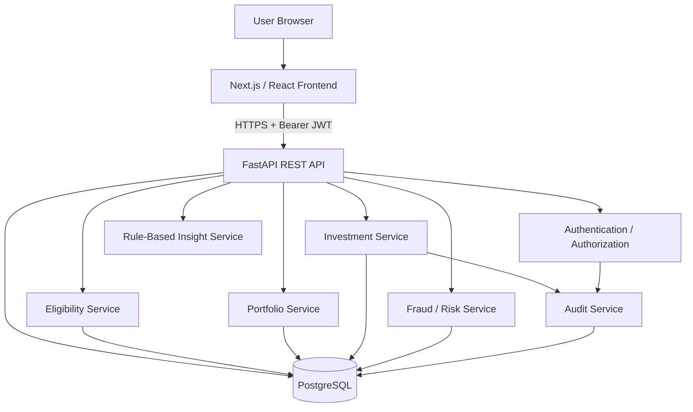

# AURIX Architecture

This repository implements the local evaluation architecture for the AURIX prototype. It is not a production deployment topology and does not represent a live brokerage or banking environment.

## Trust boundaries

1. The browser is untrusted. User IDs used for private data are derived from the authenticated JWT, not trusted from frontend parameters.
2. FastAPI validates request payloads with Pydantic and enforces authorization before database access.
3. SQLAlchemy generates parameterized statements, preventing user input from being concatenated into SQL.
4. The investment service performs eligibility, balance checking, fraud scoring, transaction creation, portfolio update, and audit logging as one logical operation with rollback on failure.
5. Secrets are provided through environment variables and excluded from Git.

## Main data model

- `users` — identity, country, subscription, KYC state
- `etfs` — investment product catalogue
- `eligibility_rules` — country + subscription eligibility rules
- `portfolios` — one portfolio per user
- `portfolio_assets` — gold, silver, ETF, cash and other allocations
- `transactions` — simulated financial events and risk result
- `audit_logs` — security and business traceability
- `revoked_tokens` — JWT logout revocation
